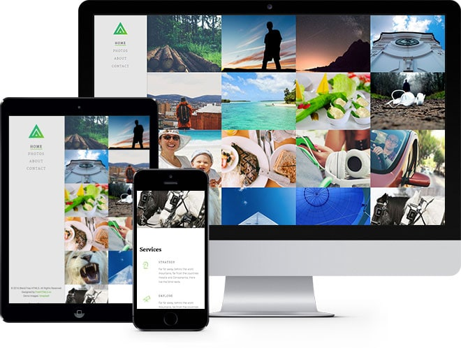
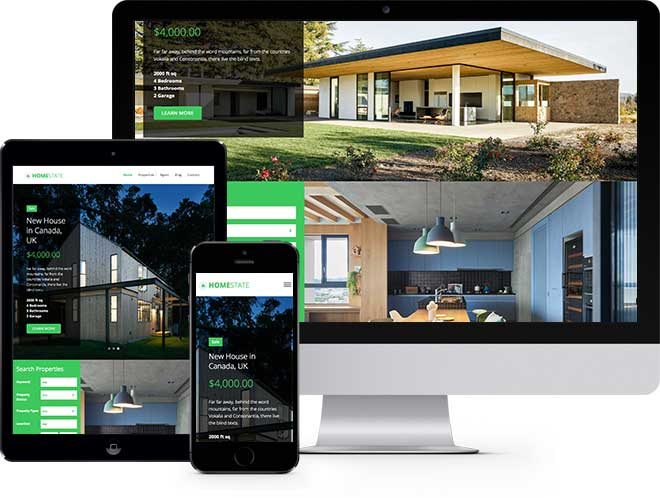
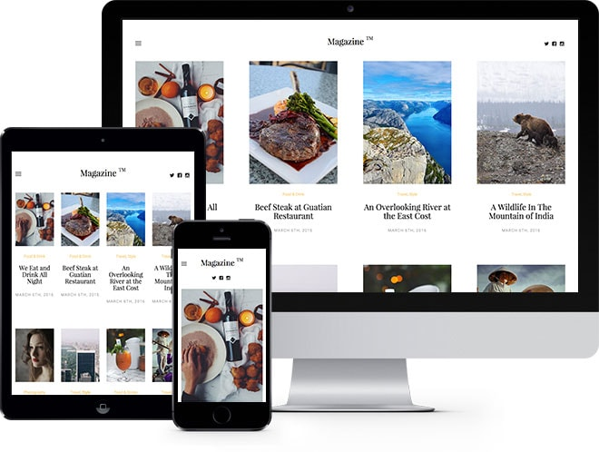
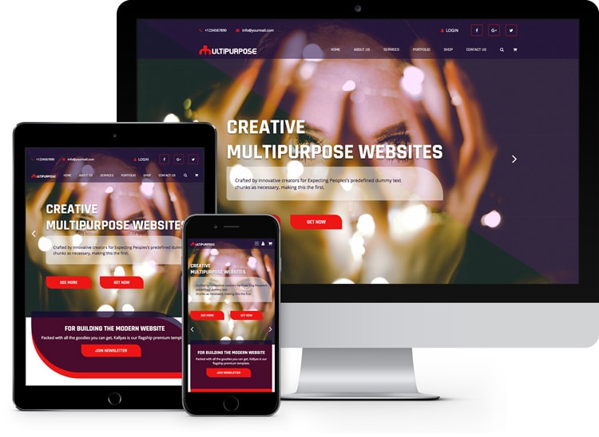
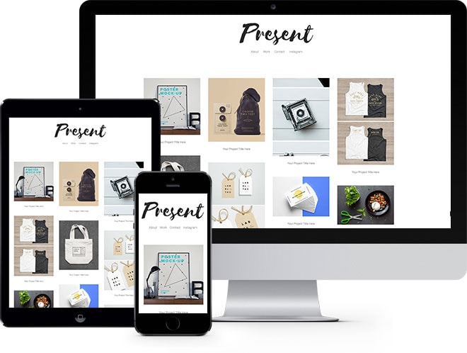
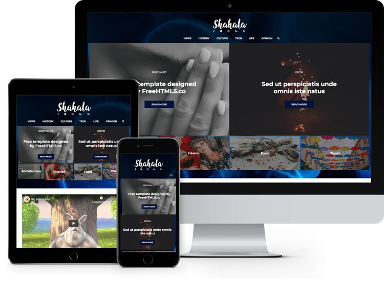
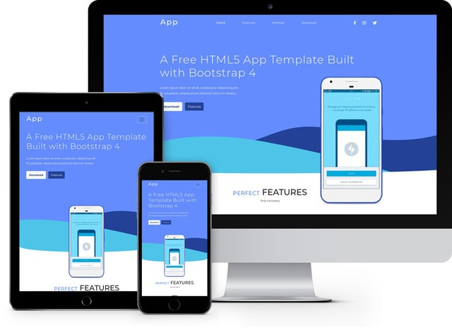
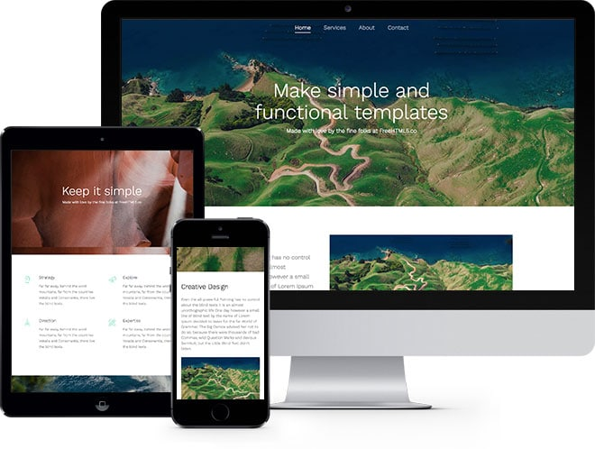
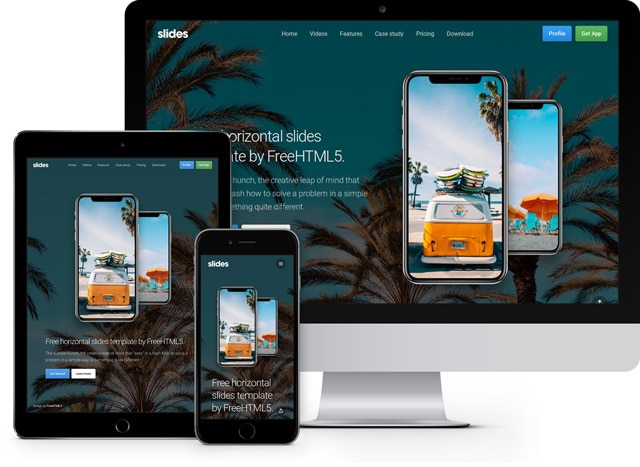

# 100 HTML5 Static Website Templates

Welcome to our collection of 100 HTML5 static website templates! These templates are designed to help you speed up your website creation process by providing fully functional, responsive, and customizable HTML5 and CSS templates. Each template is purely static, meaning you can deploy them directly to any static server, and they'll be ready to run without any additional configuration.

## Key Features:
- **100 Unique Templates**: A diverse collection of website templates, perfect for a variety of projects.
- **HTML5 + CSS**: Fully compliant with modern HTML5 and CSS standards, ensuring clean and efficient code.
- **No Dependencies**: These templates don't rely on external libraries like JavaScript frameworks or CSS preprocessors, making them lightweight and easy to maintain.
- **Easy to Deploy**: Simply download, customize, and upload to your static server — no backend is required.
- **Responsive Design**: All templates are mobile-friendly and responsive, ensuring a great user experience on any device.
- **Regular Updates**: We frequently update the collection with new templates to keep up with design trends and improvements.

## How to Use:
1. Browse through the collection and pick the template that best suits your project.
2. Download the HTML5 and CSS files.
3. Customize the content and design as needed.
4. Upload the files to your static server.
5. Your website is live and ready to go!

## Demo Link

<a href="https://html5-black.vercel.app/blend/" target="_blank">https://html5-black.vercel.app/blend/</a>
 

<a href="https://html5-black.vercel.app/homestate/" target="_blank">https://html5-black.vercel.app/homestate/</a>
 

<a href="https://html5-black.vercel.app/magazine/" target="_blank">https://html5-black.vercel.app/magazine/</a>
 

<a href="https://html5-black.vercel.app/multipurpose/" target="_blank">https://html5-black.vercel.app/multipurpose/</a>
 

<a href="https://html5-black.vercel.app/present/" target="_blank">https://html5-black.vercel.app/present/</a>
 

<a href="https://html5-black.vercel.app/shahala/" target="_blank">https://html5-black.vercel.app/shahala/</a>
 

<a href="https://html5-black.vercel.app/app/" target="_blank">https://html5-black.vercel.app/app/</a>
 

<a href="https://html5-black.vercel.app/simple/" target="_blank">https://html5-black.vercel.app/simple/</a>
 

<a href="https://html5-black.vercel.app/slides/" target="_blank">https://html5-black.vercel.app/slides/</a>

## Contribution:
This project is open source, and contributions are welcome. If you'd like to add your own templates or improve the existing ones, feel free to submit a pull request.

## Stay Updated:
We regularly update this repository with new templates, so don't forget to star and watch this repo for the latest additions.

### License:
All templates are released under the MIT License, making them free to use for both personal and commercial projects.

---

**[Star this repo](#)** if you find it useful, and help spread the word to others looking to streamline their website creation process!

